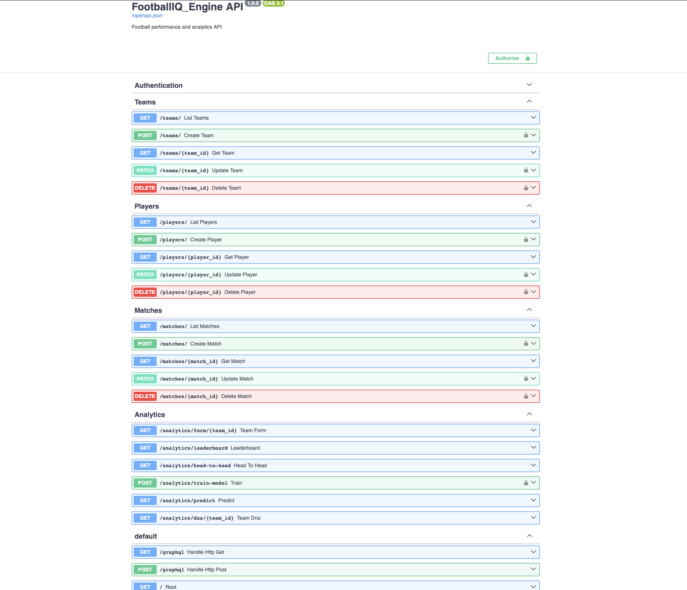
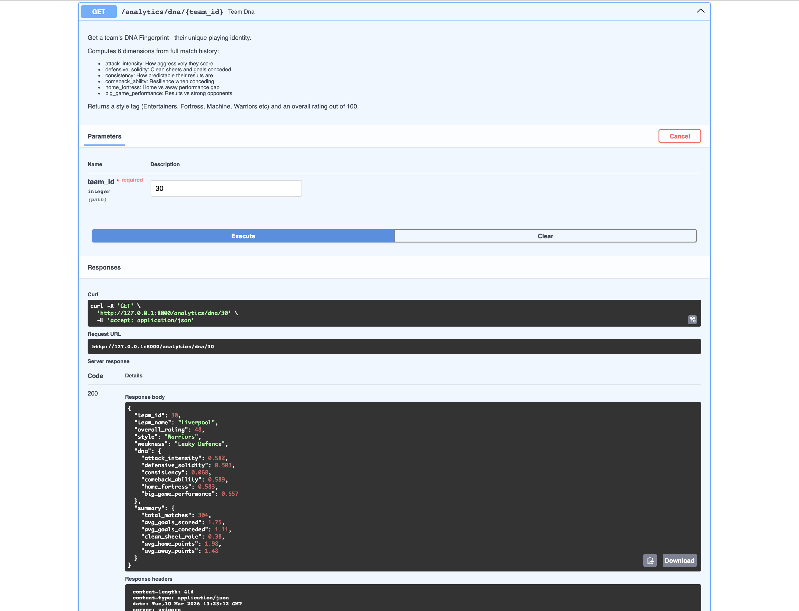
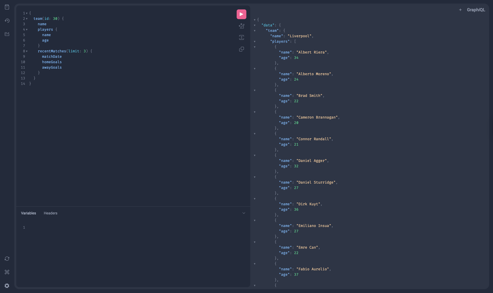
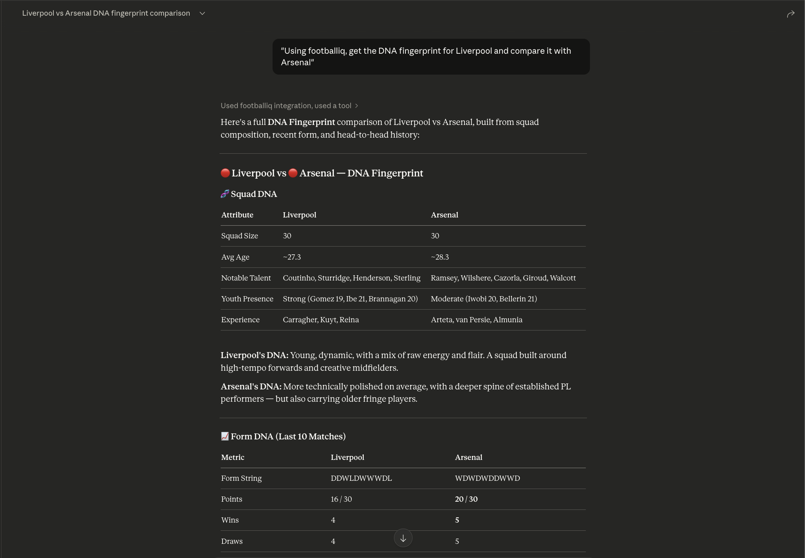
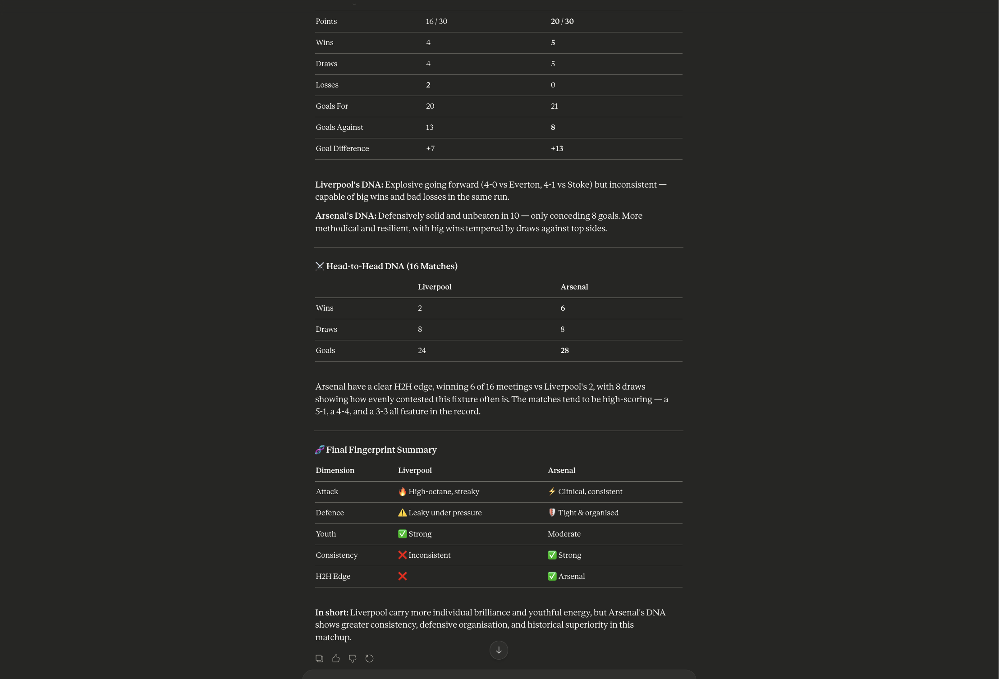
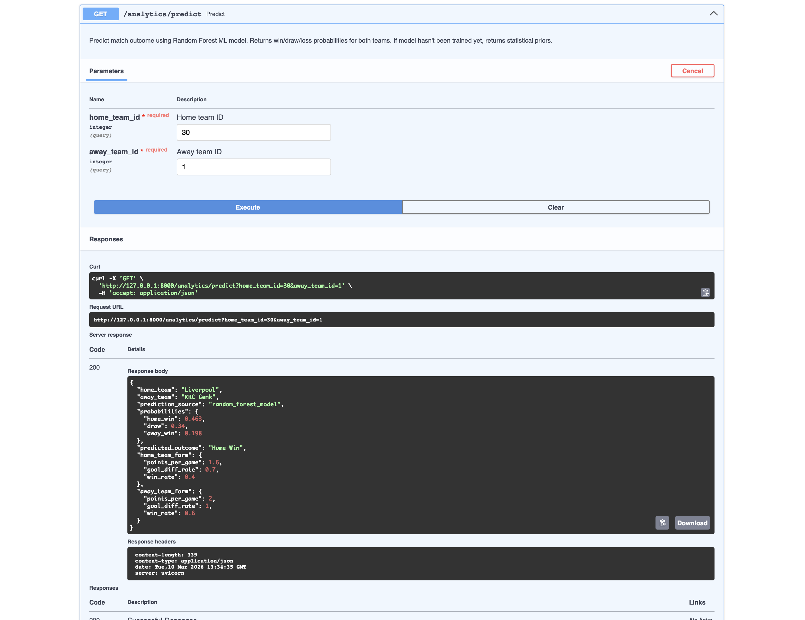

# FootballIQ_engine


> A production-grade football analytics API with Machine Learning match prediction, GraphQL support, Team DNA Fingerprinting, and an AI-native Model Context Protocol (MCP) server. Built on real European football data spanning 8 seasons and 11 leagues.

**Live API:** https://footballiq-engine.onrender.com  
**Interactive Docs:** https://footballiq-engine.onrender.com/docs  
**GraphQL Playground:** https://footballiq-engine.onrender.com/graphql  

---

## Screenshots

### Swagger UI - Interactive API Documentation

> *All endpoints are self-documenting via OpenAPI 3.0. Every parameter, response schema, and status code is described inline.*

### Team DNA Fingerprint — Novel Analytics Feature

> *The DNA Fingerprint endpoint computes 6 playing style dimensions from a team's full match history, returning a style tag and overall rating.*

### GraphQL Playground — Nested Queries

> *GraphQL allows fetching a team with all their players and recent matches in a single request, eliminating over-fetching.*

### MCP Server — AI-Native Interface


> *Claude Desktop using FootballIQ tools autonomously — searching for teams, fetching form, predicting outcomes and comparing DNA fingerprints in a single conversation.*

### ML Prediction — Live Response

> *The prediction endpoint returns home win, draw and away win probabilities computed by a Random Forest trained on 20,743 historical matches.*

---

## 📋 Table of Contents

- [Overview](#overview)
- [Tech Stack](#tech-stack)
- [Dataset](#dataset)
- [Features](#features)
- [Novel Feature — Team DNA Fingerprint](#novel-feature--team-dna-fingerprint)
- [Getting Started](#getting-started)
- [API Reference](#api-reference)
- [Machine Learning](#machine-learning)
- [GraphQL](#graphql)
- [MCP Server — AI Native Interface](#mcp-server--ai-native-interface)
- [Testing](#testing)
- [Deployment](#deployment)
- [Design Decisions](#design-decisions)
- [Project Structure](#project-structure)

---

## Overview

FootballIQ Engine transforms raw European football data into intelligent, queryable insights. It is designed around three principles:

1. **Data fidelity** — 25,979 real matches across 8 seasons, imported from the Kaggle European Soccer Database
2. **Analytical depth** — going beyond raw statistics to compute derived insights like playing style DNA, form trajectories, and probabilistic match outcomes
3. **AI-native design** — built from the ground up to be usable by AI assistants via the Model Context Protocol, representing a forward-looking approach to API design

The API follows REST conventions for CRUD operations, extends to GraphQL for complex nested queries, and exposes an MCP server for direct AI integration — making it accessible to three distinct types of consumers simultaneously.

---

## Tech Stack

| Component | Technology | Version | Rationale |
|---|---|---|---|
| Framework | FastAPI | 0.111 | Auto OpenAPI docs, async support, Pydantic validation |
| Database | SQLite + SQLAlchemy | 2.0+ | Zero-config, portable, sufficient for read-heavy workload |
| Authentication | JWT (python-jose) + bcrypt | — | Stateless, industry standard, Python 3.13 compatible |
| Machine Learning | scikit-learn Random Forest | 1.4+ | Tabular data specialist, interpretable, no GPU needed |
| GraphQL | Strawberry | 0.262 | Native Python type hints, FastAPI integration |
| AI Interface | FastMCP | 0.4+ | MCP protocol for Claude Desktop and AI tool use |
| Deployment | Render.com | — | Auto-deploy from GitHub, free tier, sufficient storage |
| Testing | pytest + httpx | — | Async-compatible, TestClient for HTTP simulation |

---

## Dataset

**Source:** [Kaggle European Soccer Database](https://www.kaggle.com/datasets/hugomathien/soccer) — Hugo Mathien

| Entity | Count | Notes |
|---|---|---|
| Teams | 296 | 11 European leagues |
| Players | 11,060 | Linked to teams via match lineup parsing |
| Matches | 25,979 | 8 seasons: 2008/2009 – 2015/2016 |
| Leagues | 11 | England, Spain, Germany, France, Italy, Belgium, etc. |

**Data Engineering:**
Player-team relationships were not directly available in the dataset. They were extracted by parsing the match lineup columns (`home_player_1` through `home_player_11`, `away_player_1` through `away_player_11`) across all 25,979 matches, identifying the most recent team each player appeared for. This linked **10,961 of 11,060 players** to a team.

---

## Features

### Full CRUD with JWT Authentication
All three core entities (Teams, Players, Matches) support complete Create, Read, Update, Delete operations. Endpoints are protected by role:
- **Public** — all GET (read) endpoints
- **Authenticated users** — POST and PATCH (create and update)
- **Admin only** — DELETE and model retraining

Passwords are never stored in plain text — bcrypt produces a 60-character hash. JWTs expire after 30 minutes for security.

### Analytics Engine
Three analytical endpoints built on top of the match data:

**Team Form** — computes the last N match results for any team, returning points, goals, and a W/D/L string like "WWDLW".

**Leaderboard** — generates a full league table for any competition and season, sorting by points → goal difference → goals scored — exactly how real football tables work.

**Head to Head** — returns the complete historical record between two teams with win/draw/loss summary.

### ML Match Prediction
A Random Forest classifier predicts match outcomes with 49.5% accuracy — significantly above the 33% random baseline and the 45% naive home-win baseline.

### Team DNA Fingerprint *(Novel Feature — see below)*

### GraphQL Interface
Strawberry GraphQL mounted alongside REST, enabling nested queries that would require multiple REST calls to replicate.

### MCP Server
8 tools exposed via the Model Context Protocol — Claude Desktop can autonomously search teams, fetch analytics, and predict matches through natural language.

---

## Novel Feature — Team DNA Fingerprint

> `GET /analytics/dna/{team_id}`

This is an original analytical concept with no direct equivalent in commercial football APIs. Every team has a unique playing identity that raw statistics fail to capture. The DNA Fingerprint distils a team's entire match history into 6 normalised dimensions (0–1):

| Dimension | Computation | What it reveals |
|---|---|---|
| `attack_intensity` | Average goals scored / 3.0 (capped at 1.0) | How aggressively a team scores |
| `defensive_solidity` | (Clean sheet rate + (1 - avg goals conceded / 3)) / 2 | Defensive organisation |
| `consistency` | 1 - (std dev of points / 1.4) | How predictable results are |
| `comeback_ability` | Matches earning points after conceding / total matches conceding | Mental resilience |
| `home_fortress` | (Home PPG - Away PPG + 3) / 6, clamped 0–1 | Home ground advantage |
| `big_game_performance` | PPG vs top-half opponents, normalised | Performing under pressure |

The system assigns a **style tag** based on the dominant dimension:

| Style | Dominant Trait |
|---|---|
| Entertainers | High attack intensity |
| Fortress | High defensive solidity |
| Machine | High consistency |
| Warriors | High comeback ability |
| Home Kings | High home fortress |
| Big Game Players | High big game performance |

**Example — Liverpool (304 matches analysed):**
```json
{
  "team_name": "Liverpool",
  "overall_rating": 48.0,
  "style": "Warriors",
  "weakness": "Leaky Defence",
  "dna": {
    "attack_intensity": 0.582,
    "defensive_solidity": 0.503,
    "consistency": 0.068,
    "comeback_ability": 0.589,
    "home_fortress": 0.583,
    "big_game_performance": 0.557
  }
}
```

Liverpool's Warriors tag is historically accurate — they were known for dramatic comebacks and resilient performances in this era. Their Leaky Defence weakness reflects their high-risk attacking style under managers like Brendan Rodgers.

---

## Getting Started

### Prerequisites
- Python 3.11+
- Git

### Installation

```bash
# Clone the repo
git clone https://github.com/TahzimMohammed/footballIQ_engine.git
cd footballIQ_engine

# Create virtual environment
python -m venv venv
source venv/bin/activate  # Windows: venv\Scripts\activate

# Install dependencies
pip install -r requirements.txt
```

### Environment Variables

Create a `.env` file in the project root:

```env
SECRET_KEY=your-secret-key-here
DATABASE_URL=sqlite:///./footballiq.db
ACCESS_TOKEN_EXPIRE_MINUTES=30
ALGORITHM=HS256
```

### Run the API

```bash
uvicorn app.main:app --reload
```

Visit `http://127.0.0.1:8000/docs` for the Swagger UI.

### Create Admin User

```bash
python -c "
from app.database import SessionLocal
from app.models.models import User
from app.services.auth import hash_password
db = SessionLocal()
admin = User(
    username='admin',
    email='admin@footballiq.com',
    hashed_password=hash_password('admin123'),
    is_admin=True
)
db.add(admin)
db.commit()
print('Admin created successfully')
"
```

---

## API Reference

### Authentication

| Method | Endpoint | Auth | Status | Description |
|---|---|---|---|---|
| POST | `/auth/register` | None | 201 | Register new user account |
| POST | `/auth/token` | None | 200 | Login, returns JWT bearer token |

### Teams

| Method | Endpoint | Auth | Status | Description |
|---|---|---|---|---|
| GET | `/teams/` | None | 200 | List teams — paginated, filter by `country` |
| GET | `/teams/{id}` | None | 200 / 404 | Get single team |
| POST | `/teams/` | User | 201 / 401 | Create team |
| PATCH | `/teams/{id}` | User | 200 / 401 / 404 | Partial update |
| DELETE | `/teams/{id}` | Admin | 204 / 403 / 404 | Delete team |

### Players

| Method | Endpoint | Auth | Status | Description |
|---|---|---|---|---|
| GET | `/players/` | None | 200 | List players — filter by `team_id`, `position` |
| GET | `/players/{id}` | None | 200 / 404 | Get single player |
| POST | `/players/` | User | 201 / 401 | Create player |
| PATCH | `/players/{id}` | User | 200 / 401 / 404 | Partial update |
| DELETE | `/players/{id}` | Admin | 204 / 403 / 404 | Delete player |

### Matches

| Method | Endpoint | Auth | Status | Description |
|---|---|---|---|---|
| GET | `/matches/` | None | 200 | List matches — filter by `season`, `competition` |
| GET | `/matches/{id}` | None | 200 / 404 | Get single match |
| POST | `/matches/` | User | 201 / 401 | Create match |
| PATCH | `/matches/{id}` | User | 200 / 401 / 404 | Partial update |
| DELETE | `/matches/{id}` | Admin | 204 / 403 / 404 | Delete match |

### Analytics

| Method | Endpoint | Auth | Status | Description |
|---|---|---|---|---|
| GET | `/analytics/form/{team_id}` | None | 200 / 404 | Last N match results |
| GET | `/analytics/leaderboard` | None | 200 / 404 | Full league table |
| GET | `/analytics/head-to-head` | None | 200 / 400 / 404 | H2H between two teams |
| GET | `/analytics/predict` | None | 200 / 400 | ML outcome probabilities |
| GET | `/analytics/dna/{team_id}` | None | 200 / 400 / 404 | Team DNA Fingerprint |
| POST | `/analytics/train-model` | Admin | 200 / 403 | Retrain Random Forest |

### Status Codes

| Code | Meaning |
|---|---|
| 200 | Success |
| 201 | Created |
| 204 | Deleted (no content returned) |
| 400 | Bad request (e.g. same team in H2H) |
| 401 | Unauthorised (missing or invalid token) |
| 403 | Forbidden (insufficient role) |
| 404 | Resource not found |
| 422 | Validation error (invalid input type) |

---

## Machine Learning

### Model

`RandomForestClassifier(n_estimators=100, random_state=42)` from scikit-learn.

### Features (7 total)

| Feature | Description |
|---|---|
| `home_ppg` | Home team points per game (all-time) |
| `home_goal_diff_rate` | Home team average goal difference per game |
| `home_win_rate` | Home team win percentage |
| `away_ppg` | Away team points per game (all-time) |
| `away_goal_diff_rate` | Away team average goal difference per game |
| `away_win_rate` | Away team win percentage |
| `home_advantage` | Constant 1.0 — model learns its weight from data |

### Performance

| Metric | Value |
|---|---|
| Training set | 20,743 matches (80%) |
| Test set | 5,186 matches (20%) |
| **Accuracy** | **49.5%** |
| Random baseline | 33.3% |
| Naive home-win baseline | ~45% |

The 49.5% accuracy exceeds both baselines. Football outcome prediction is inherently noisy — even commercial betting models rarely exceed 55-60% on unseen data, as individual match results contain significant randomness beyond team quality metrics.

---

## GraphQL

Access the interactive playground at `/graphql`.

**Single nested query (replaces 3 REST calls):**
```graphql
{
  team(id: 30) {
    name
    players {
      name
      age
      position
    }
    recentMatches(limit: 3) {
      matchDate
      homeGoals
      awayGoals
      competition
    }
  }
}
```

Note: GraphQL uses camelCase (`matchDate`, `homeGoals`) following GraphQL convention, while REST uses snake_case following Python convention.

---

## MCP Server — AI Native Interface

The Model Context Protocol (released by Anthropic, November 2024) is a standard for connecting AI assistants to external tools. FootballIQ implements an MCP server, making it natively accessible to AI assistants like Claude Desktop.

### Available Tools (8)

| Tool | Description |
|---|---|
| `search_team` | Find a team by name |
| `get_form` | Last N match results |
| `get_standings` | Full league table |
| `predict_outcome` | ML match prediction |
| `head_to_head` | Historical H2H record |
| `list_teams` | Browse all 296 teams |
| `get_team_players` | Squad list |
| `get_dna_fingerprint` | 6-dimension style analysis |

### Setup for Claude Desktop

Add to `~/Library/Application Support/Claude/claude_desktop_config.json`:

```json
{
  "mcpServers": {
    "footballiq": {
      "command": "/absolute/path/to/venv/bin/python",
      "args": ["/absolute/path/to/footballIQ_Engine/mcp_server/server.py"]
    }
  }
}
```

Then ask Claude: *"Using footballiq, compare the DNA fingerprint of Liverpool and Arsenal and predict their next match"*

---

## Testing

```bash
python -m pytest tests/ -v
# 18 passed in 3.13s
```

Tests use a separate in-memory SQLite database — the production database is never touched. All 18 tests cover auth, CRUD, and analytics including edge cases (duplicate registration, same-team H2H, probability sum validation).

---

## Deployment

| | |
|---|---|
| Platform | Render.com (free tier) |
| Live URL | https://footballiq-engine.onrender.com |
| Docs | https://footballiq-engine.onrender.com/docs |
| Python | 3.11 (pinned via `.python-version`) |
| Auto-deploy | On every push to `main` |

**Note:** Free tier spins down after 15 minutes of inactivity. First request after inactivity takes ~50 seconds to wake up.

---

## Design Decisions

**FastAPI over Django** — automatic OpenAPI docs from type hints, cleaner dependency injection, less boilerplate than Django REST Framework.

**SQLite over PostgreSQL** — zero infrastructure, portable, handles 25,979 matches efficiently. Migrating to PostgreSQL only requires changing `DATABASE_URL`.

**bcrypt directly over passlib** — passlib has a known incompatibility with Python 3.13. bcrypt directly provides identical security without the issue.

**Random Forest over Neural Network** — tree-based models consistently outperform neural networks on tabular data of this size. Also interpretable via feature importance.

**GraphQL alongside REST** — REST for CRUD, GraphQL for nested data queries that would otherwise require multiple round trips.

**MCP over a chatbot wrapper** — MCP keeps the API stateless and language-agnostic. Any MCP-compatible AI assistant can use it without a bespoke integration layer.

**PATCH over PUT** — `exclude_unset=True` only updates fields the client explicitly sends, preventing null overwrites on unsent fields.

**JWT expiry at 30 minutes** — limits exposure window if a token is stolen. Configurable via `ACCESS_TOKEN_EXPIRE_MINUTES` in `.env`.

---

## Project Structure

```
footballIQ_Engine/
├── app/
│   ├── main.py                  # FastAPI app, all router registration
│   ├── config.py                # Pydantic-settings, .env loading
│   ├── database.py              # SQLAlchemy engine, SessionLocal, get_db()
│   ├── models/models.py         # ORM models: User, Team, Player, Match
│   ├── schemas/schemas.py       # Pydantic schemas: Base, Create, Update, Out
│   ├── routers/
│   │   ├── auth.py              # /auth/register, /auth/token
│   │   ├── teams.py             # /teams/ CRUD
│   │   ├── players.py           # /players/ CRUD
│   │   ├── matches.py           # /matches/ CRUD
│   │   └── analytics.py        # /analytics/ all endpoints
│   ├── services/
│   │   ├── auth.py              # JWT + bcrypt logic
│   │   └── analytics.py        # All analytics business logic
│   ├── ml/
│   │   ├── predictor.py         # RandomForest train + predict
│   │   └── model.pkl            # Trained model (joblib)
│   └── graphql_schema.py        # Strawberry types + resolvers
├── mcp_server/server.py         # FastMCP server, 8 tools
├── tests/
│   ├── conftest.py              # In-memory DB, TestClient fixtures
│   ├── test_auth.py             # 5 auth tests
│   ├── test_teams.py            # 7 CRUD tests
│   └── test_analytics.py       # 6 analytics tests
├── docs/images/                 # Screenshots for README
├── import_kaggle.py             # One-time data import
├── requirements.txt
├── .python-version              # Pins Python 3.11 for Render
└── README.md
```

---

## Acknowledgements

- Dataset: [Hugo Mathien — Kaggle European Soccer Database](https://www.kaggle.com/datasets/hugomathien/soccer)
- MCP Protocol: [Anthropic Model Context Protocol](https://modelcontextprotocol.io)
- Framework: [FastAPI](https://fastapi.tiangolo.com)

---
